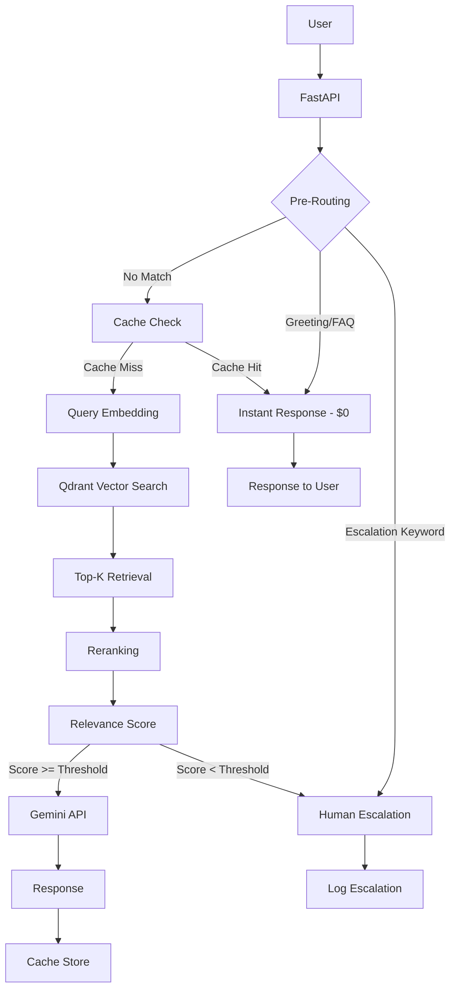

# Academia AI Assistant

RAG-powered intelligent customer support system for a Colombian language academy. Built with FastAPI, Qdrant, and Google Gemini.

## Overview

This system handles repetitive customer inquiries about language courses by:
1. Receiving user questions via REST API
2. **Pre-routing layer**: Responds instantly to greetings and FAQs (zero API cost)
3. Searching the academy's knowledge base using vector similarity
4. Applying reranking and relevance scoring
5. Generating grounded responses using Gemini (only from verified knowledge)
6. Escalating to human support when confidence is low
7. Remembering user profiles across sessions

## Architecture



## Technologies

| Component | Technology | Why |
|-----------|-----------|-----|
| API Framework | FastAPI | Async, fast, built-in validation |
| Vector DB | Qdrant | Local persistent storage, no external deps |
| LLM | Google Gemini 3.5 Flash Lite | Cost-effective, fast |
| Embeddings | gemini-embedding-001 | Google's embedding model |
| Database | SQLite | Zero config, portable, sufficient for metrics/cache |
| Chunking | tiktoken + langchain | Token-aware splitting |
| User Memory | JSON persistence | Simple, no extra dependencies |

## Project Structure

```
academia_ai_assistant/
├── config/
│   └── settings.py          # Pydantic Settings configuration
├── data/
│   ├── documents/            # Knowledge base (Markdown)
│   │   ├── precios_y_niveles.md
│   │   ├── horarios_y_modalidades.md
│   │   └── certificaciones_e_inscripciones.md
│   ├── usuarios.json         # User profiles persistence
│   └── qdrant/               # Vector DB storage (auto-created)
├── rag/
│   ├── chunker.py            # Token-aware text chunking
│   ├── ingest.py             # Document ingestion pipeline
│   ├── retriever.py          # Vector search retrieval
│   ├── reranker.py           # Lightweight reranking
│   └── scoring.py            # Score normalization & threshold
├── llm/
│   ├── client.py             # Async Gemini client
│   └── prompts.py            # System prompt & templates
├── services/
│   ├── chat_service.py       # Main orchestration logic
│   ├── pre_routing.py        # Pre-defined responses (zero cost)
│   ├── user_memory.py        # User profile persistence
│   ├── cache_service.py      # SQLite + memory cache
│   ├── escalation_service.py # Human escalation logging
│   └── metrics_service.py    # Query metrics tracking
├── database/
│   └── sqlite.py             # SQLite connection & schema
├── api/
│   └── routes.py             # FastAPI endpoints
├── tests/                    # Test suite (117 tests)
├── main.py                   # Application entry point
├── requirements.txt
├── .env.example
└── .gitignore
```

## Environment Variables

Copy `.env.example` to `.env` and fill in your values:

```bash
cp .env.example .env
```

| Variable | Default | Description |
|----------|---------|-------------|
| `GEMINI_API_KEY` | (required) | Your Google Gemini API key |
| `GEMINI_MODEL` | `gemini-3.5-flash-lite` | LLM model |
| `GEMINI_EMBEDDING_MODEL` | `gemini-embedding-001` | Embedding model |
| `GEMINI_TEMPERATURE` | `0.0` | LLM temperature |
| `GEMINI_MAX_OUTPUT_TOKENS` | `350` | Max LLM output tokens |
| `QDRANT_PATH` | `./data/qdrant` | Qdrant storage path |
| `QDRANT_COLLECTION_NAME` | `academy_knowledge` | Collection name |
| `TOP_K` | `5` | Number of retrieval candidates |
| `RAG_SCORE_THRESHOLD` | `0.70` | Minimum relevance for LLM call |
| `CACHE_ENABLED` | `true` | Enable response cache |
| `CACHE_TTL_SECONDS` | `3600` | Cache expiration time |
| `MAX_HISTORY_MESSAGES` | `4` | Max conversation history messages |
| `DATABASE_PATH` | `./data/academy.db` | SQLite database path |

## Installation

```bash
# Clone the repository
git clone <repo-url>
cd academia_ai_assistant

# Create virtual environment
python -m venv venv
source venv/bin/activate  # Linux/Mac
# venv\Scripts\activate   # Windows

# Install dependencies
pip install -r requirements.txt

# Configure environment
cp .env.example .env
# Edit .env with your GEMINI_API_KEY
```

## Document Ingestion

Before running the system, ingest the knowledge base documents:

```bash
python main.py ingest
```

This will:
- Read all Markdown files from `data/documents/`
- Split them into token-aware chunks (400 tokens, 50 overlap)
- Generate embeddings using `gemini-embedding-001`
- Store vectors in Qdrant with metadata
- Skip already-ingested documents (idempotent)

## Running the API Server

```bash
python main.py serve
# or
uvicorn main:app --host 0.0.0.0 --port 8000
```

The API will be available at `http://localhost:8000`.

A web chat UI is available at `http://localhost:8000/`.

## API Examples

### POST /chat

```bash
curl -X POST http://localhost:8000/chat \
  -H "Content-Type: application/json" \
  -d '{
    "user_id": "12345",
    "message": "¿Cuánto cuesta el curso de inglés B1?"
  }'
```

Response:
```json
{
  "response": "El curso de inglés nivel B1 (Intermedio Bajo) tiene un valor de **$450.000 COP**. Duración: 2.5 meses (40 horas).",
  "escalated": false,
  "cached": false,
  "relevance_score": 1.0,
  "request_id": "a1b2c3d4",
  "input_tokens": 0,
  "output_tokens": 0,
  "model": "pre_routing"
}
```

### Pre-Routing Examples (Zero API Cost)

These queries are answered instantly without calling the LLM:

```bash
# Greeting
curl -X POST http://localhost:8000/chat \
  -H "Content-Type: application/json" \
  -d '{"user_id": "1", "message": "hola"}'

# Bot identity
curl -X POST http://localhost:8000/chat \
  -H "Content-Type: application/json" \
  -d '{"user_id": "1", "message": "como te llamas"}'

# Specific pricing
curl -X POST http://localhost:8000/chat \
  -H "Content-Type: application/json" \
  -d '{"user_id": "1", "message": "cuanto cuesta ingles B1"}'

# Schedules
curl -X POST http://localhost:8000/chat \
  -H "Content-Type: application/json" \
  -d '{"user_id": "1", "message": "horarios de clases"}'

# Modalities
curl -X POST http://localhost:8000/chat \
  -H "Content-Type: application/json" \
  -d '{"user_id": "1", "message": "que modalidades tienen"}'

# Location
curl -X POST http://localhost:8000/chat \
  -H "Content-Type: application/json" \
  -d '{"user_id": "1", "message": "donde estan ubicados"}'

# Contact
curl -X POST http://localhost:8000/chat \
  -H "Content-Type: application/json" \
  -d '{"user_id": "1", "message": "cual es el telefono"}'

# Enrollment
curl -X POST http://localhost:8000/chat \
  -H "Content-Type: application/json" \
  -d '{"user_id": "1", "message": "como me inscribo"}'

# Certificates
curl -X POST http://localhost:8000/chat \
  -H "Content-Type: application/json" \
  -d '{"user_id": "1", "message": "que certificados dan"}'

# Discounts
curl -X POST http://localhost:8000/chat \
  -H "Content-Type: application/json" \
  -d '{"user_id": "1", "message": "tienen descuentos"}'

# Payment methods
curl -X POST http://localhost:8000/chat \
  -H "Content-Type: application/json" \
  -d '{"user_id": "1", "message": "como puedo pagar"}'

# Availability
curl -X POST http://localhost:8000/chat \
  -H "Content-Type: application/json" \
  -d '{"user_id": "1", "message": "hay cupos disponibles"}'
```

### Escalation Examples (Direct to Human)

```bash
# Problem with schedule
curl -X POST http://localhost:8000/chat \
  -H "Content-Type: application/json" \
  -d '{"user_id": "1", "message": "tengo un problema con mi horario"}'

# Request human agent
curl -X POST http://localhost:8000/chat \
  -H "Content-Type: application/json" \
  -d '{"user_id": "1", "message": "quiero hablar con un asesor"}'
```

### User Memory Example

```bash
# First message - user introduces themselves
curl -X POST http://localhost:8000/chat \
  -H "Content-Type: application/json" \
  -d '{"user_id": "99", "message": "me llamo Sergi, tengo 25 años, quiero inscribirme en inglés"}'

# Next message - bot remembers the user
curl -X POST http://localhost:8000/chat \
  -H "Content-Type: application/json" \
  -d '{"user_id": "99", "message": "cuanto cuesta?"}'
```

### GET /health

```bash
curl http://localhost:8000/health
```

```json
{"status": "ok"}
```

### GET /metrics

```bash
curl http://localhost:8000/metrics
```

```json
{
  "total_queries": 100,
  "successful_queries": 85,
  "human_escalations": 15,
  "cache_hits": 35,
  "cache_misses": 65,
  "llm_requests": 50,
  "embedding_requests": 0,
  "average_response_time_ms": 1250.5,
  "estimated_input_tokens": 25000,
  "estimated_output_tokens": 8500,
  "estimated_cost_usd": 0.0089
}
```

## Processing Layers

### Layer 1: Pre-Routing (Zero API Cost)
- **Greetings**: "hola", "buenos días", etc. → instant welcome message
- **FAQs**: Prices, schedules, location, contact, enrollment, etc. → instant response
- **Escalation keywords**: "problema", "hablar con asesor", "queja" → direct human escalation

### Layer 2: RAG Pipeline
- Query embedding → Vector search in Qdrant → Top-K retrieval → Reranking
- Score normalization → Threshold check (0.70)
- If score < threshold → human escalation (no LLM call)

### Layer 3: LLM Generation
- Only called if Layer 2 score >= threshold
- Context + query → Gemini with grounding prompt
- Response cached for future queries

## RAG Pipeline

1. **Query Normalization**: Lowercase, remove punctuation, normalize whitespace
2. **Embedding**: Generate query embedding via `gemini-embedding-001`
3. **Vector Search**: Retrieve Top-K candidates from Qdrant (cosine similarity)
4. **Reranking**: Combine vector score (70%) with keyword overlap (30%)
5. **Score Normalization**: Map raw cosine score to [0.0, 1.0] range
6. **Threshold Check**: If score < 0.70, escalate to human (no LLM call)
7. **Context Selection**: Use only chunks with rerank_score > 0.1
8. **LLM Generation**: Send context + query to Gemini with grounding prompt
9. **Response**: Return grounded answer or escalation marker

## Relevance Threshold Behavior

| Score | Action |
|-------|--------|
| >= 0.70 | Call LLM with retrieved context |
| < 0.70 | Skip LLM, escalate to human support |

This saves API costs by avoiding LLM calls when retrieval quality is insufficient.

## Reranking Strategy

The lightweight reranker combines two signals:
- **Vector similarity** (70% weight): Cosine similarity from Qdrant
- **Keyword overlap** (30% weight): Ratio of query keywords found in document

No external reranking API needed. Suitable for small knowledge bases (< 100 documents).

## Cache System

Two-layer cache:
1. **In-memory dict**: Instant lookups, lost on restart
2. **SQLite table**: Persistent across restarts

Cache key is based on normalized query text. TTL is configurable (default: 1 hour).

## User Memory

The system remembers user information across sessions:
- **Name**: Extracted from "me llamo...", "mi nombre es..."
- **Age**: Extracted from "tengo X años..."
- **Interest**: Extracted from "quiero inscribirme en inglés/francés/portugués"
- **Query count**: Tracks number of interactions

Stored in `data/usuarios.json` and injected into LLM context for personalized responses.

## Metrics

Tracked per query:
- Total queries, successful queries, escalations
- Cache hits/misses
- LLM requests count
- Token usage (input/output)
- Estimated cost (USD)
- Average response time

## Human Escalation

Triggers:
1. RAG score below threshold
2. User explicitly requests human support
3. Question is out of scope (programming, politics, etc.)
4. User requests personalized discount
5. Special case not in documentation
6. Problem with schedule or group change

Escalations are logged in SQLite with user info and context.

## Testing

```bash
# Run all tests
pytest tests/ -v

# Run specific test file
pytest tests/test_rag.py -v
pytest tests/test_threshold.py -v
pytest tests/test_escalation.py -v
pytest tests/test_cache.py -v
pytest tests/test_api.py -v
pytest tests/test_pre_routing.py -v
pytest tests/test_user_memory.py -v
```

## Deployment (Render/Railway)

1. Push code to GitHub
2. Create a new Web Service on Render or Railway
3. Set build command: `pip install -r requirements.txt`
4. Set start command: `python main.py serve`
5. Add environment variables from `.env`
6. For persistent Qdrant storage, attach a persistent volume at `./data`

**Note**: If filesystem is not persistent, run `python main.py ingest` as part of the start command or use a startup script.

## Cost Optimization

1. **Pre-routing**: Greetings and FAQs answered without API calls ($0)
2. **Cache**: Avoids repeated LLM calls for same questions
3. **Threshold**: Skips LLM when retrieval quality is low
4. **Small embedding model**: `gemini-embedding-001` is cost-effective
5. **Limited context**: Only relevant chunks sent to LLM
6. **Limited history**: Max 4 conversation messages
7. **Output limit**: Max 350 tokens per response
8. **Concise system prompt**: Reduces input tokens
9. **No unnecessary calls**: LLM only called on cache miss + sufficient score

## Why Qdrant over ChromaDB?

- Qdrant supports persistent local storage without a separate server
- Better cosine similarity performance for small-medium collections
- Simpler deployment (no Docker required for local mode)
- More mature Python client

## Why FastAPI as Orchestrator?

- Native async support for concurrent I/O
- Built-in request validation with Pydantic
- No need for n8n or external workflow tools
- Single process handles API + business logic
- Easy to test and deploy

## Limitations & Assumptions

- Knowledge base is small (< 100 documents)
- Single-server deployment (no horizontal scaling)
- SQLite for persistence (not suitable for high-concurrency writes)
- Spanish-only responses
- No user authentication on API endpoints
- Cache lost on memory restart (SQLite backup available)
